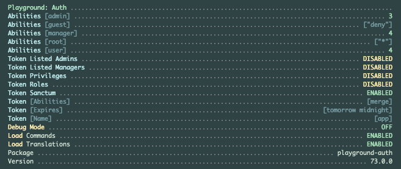

# Playground Auth

The Playground authentication package for [Laravel](https://laravel.com/docs/10.x) applications.

This package provides endpoints and a Blade UI for handling authentication and authorization.

## Installation

You can install the package via composer:

```bash
composer require gammamatrix/playground-auth
```

## Configuration

You can publish the config file with:
```bash
php artisan vendor:publish --provider="GammaMatrix\Playground\Auth\ServiceProvider" --tag="playground-config"
```

See the contents of the published config file: [config/playground-auth.php](config/playground-auth.php)

You can publish the routes file with:
```bash
php artisan vendor:publish --provider="GammaMatrix\Playground\Auth\ServiceProvider" --tag="playground-routes"
```

See the authentication routes: [routes/auth.php](routes/auth.php)

### Environment Variables

#### Loading

| env()                           | config()                   |
|---------------------------------|----------------------------|
| `PLAYGROUND_AUTH_LOAD_COMMANDS` | `playground-auth.load.commands` |
| `PLAYGROUND_LOAD_ROUTES`        | `playground-auth.load.routes`   |
| `PLAYGROUND_LOAD_VIEWS`         | `playground-auth.load.views`    |

`PLAYGROUND_LOAD_ROUTES` must be enabled to load the routes in the application (unless published to your app - the control for this is in the [ServiceProvider.php](src/ServiceProvider.php))

#### Routes

All routes are disabled by default in the base Playground package.

| env()                             | config()                     |
|-----------------------------------|------------------------------|
| `PLAYGROUND_AUTH_ROUTES_RESET`    | `playground-auth.routes.confirm`  |
| `PLAYGROUND_AUTH_ROUTES_FORGOT`   | `playground-auth.routes.forgot`   |
| `PLAYGROUND_AUTH_ROUTES_LOGOUT`   | `playground-auth.routes.logout`   |
| `PLAYGROUND_AUTH_ROUTES_LOGIN`    | `playground-auth.routes.login`    |
| `PLAYGROUND_AUTH_ROUTES_REGISTER` | `playground-auth.routes.register` |
| `PLAYGROUND_AUTH_ROUTES_RESET`    | `playground-auth.routes.reset`    |
| `PLAYGROUND_AUTH_ROUTES_TOKEN`    | `playground-auth.routes.token`    |
| `PLAYGROUND_AUTH_ROUTES_RESET`    | `playground-auth.routes.verify`   |

### UI

| env()                            | config()                         |
|----------------------------------|----------------------------------|
| `PLAYGROUND_AUTH_LAYOUT`         | `playground-auth.layout`         |
| `PLAYGROUND_AUTH_VIEW`           | `playground-auth.view`           |
| `PLAYGROUND_AUTH_SITEMAP_ENABLE` | `playground-auth.sitemap.enable` |
| `PLAYGROUND_AUTH_SITEMAP_GUEST`  | `playground-auth.sitemap.guest`  |
| `PLAYGROUND_AUTH_SITEMAP_USER`   | `playground-auth.sitemap.user`   |
| `PLAYGROUND_AUTH_SITEMAP_VIEW`   | `playground-auth.sitemap.view`   |

## Commands

This package adds a command to hash a password from the command line:

```bash
artisan auth:hash-password 'some password'
```

```bash
artisan auth:hash-password 'some password' --json --pretty
```
```json
{
    "password": "$2y$10$langzXKRw1GgO6VgF0IrSecqxi3gAsU5NgmmERT\/2pQXg06mSbEjS"
}
```

## Testing

```sh
composer test
```

## About

Playground provides information in the `artisan about` command.



## Changelog

Please see [CHANGELOG](CHANGELOG.md) for more information on what has changed recently.

## Credits

- [Jeremy Postlethwaite](https://github.com/gammamatrix)

## License

The MIT License (MIT). Please see [License File](LICENSE.md) for more information.
